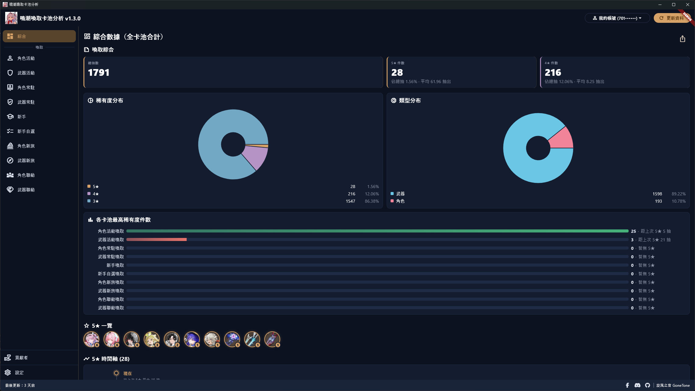
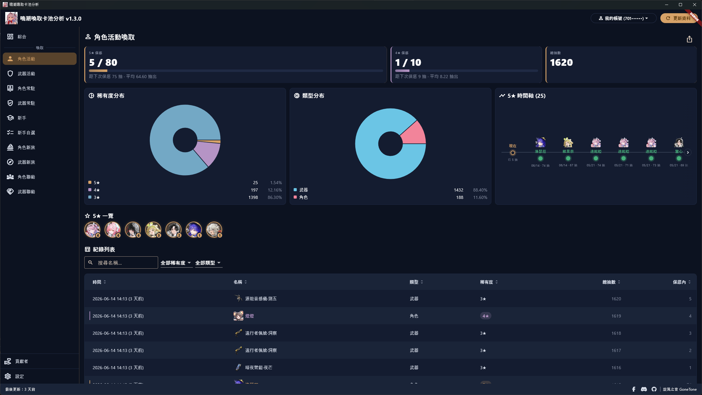
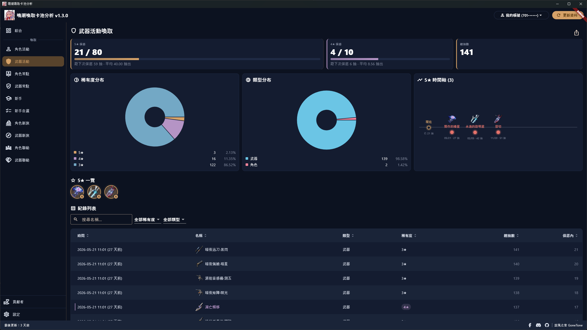
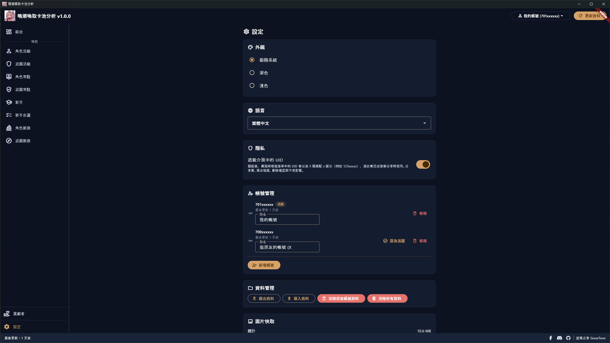
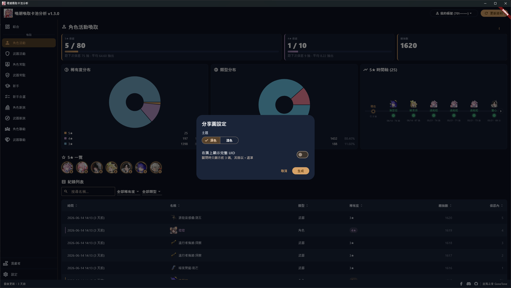
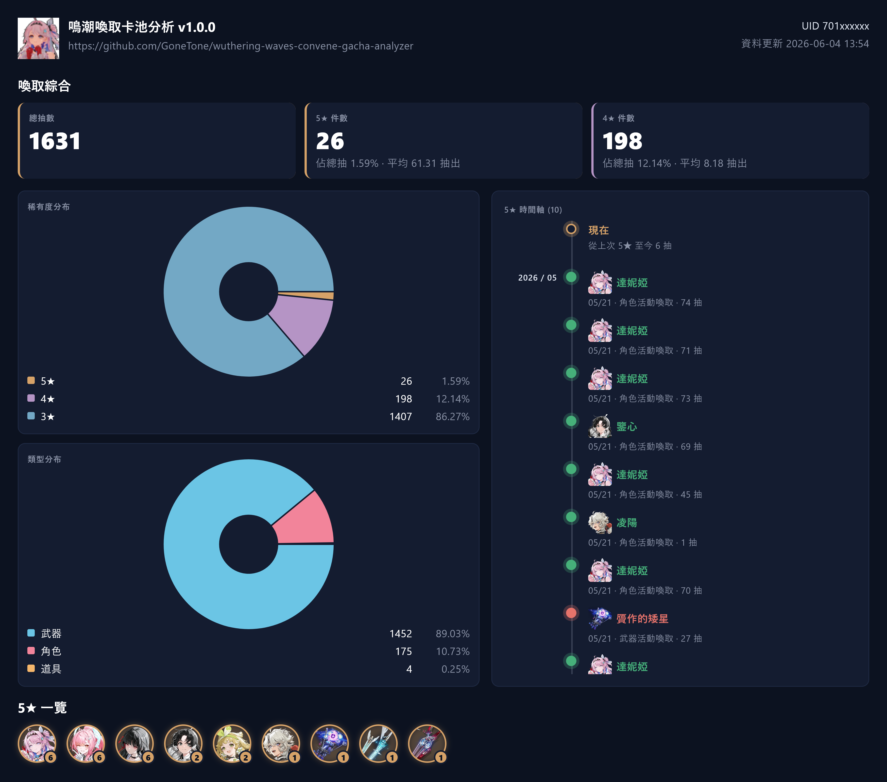
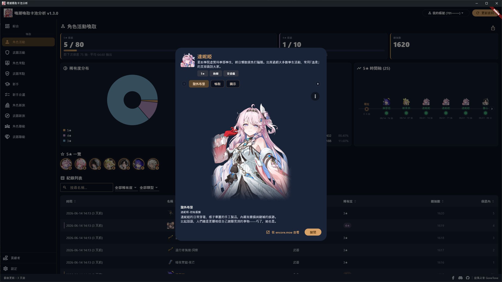

# 鳴潮喚取卡池分析 Wuthering Waves Convene Gacha Analyzer

繁體中文 | [简体中文](README_ZH-HANS.md) | [English](README_EN.md) | [日本語](README_JA-JP.md)

[](https://crowdin.com/project/wuthering-waves-convene-gacha-analyzer)

我開發了一套用來分析喚取卡池歷史記錄的軟體，一開啟各種數據清清楚楚，不用再手動計算啦！

本軟體原理是按下「更新資料」後，會在本機啟動一個只跑在您電腦上的攔截程式（需要系統管理員權限，因此會跳出一次 UAC 確認，請按「是」），並自動安裝一張本機產生的根憑證；接著把鳴潮喚取記錄頁面對官方喚取歷史 API 的那一條請求重導向到本機解析，藉此攔下該請求。所以要在按下更新後再到遊戲內開啟喚取記錄才能攔到，攔到後解析出查詢喚取記錄所需的參數，這些參數會用於官方喚取相關的 API。攔截只在更新期間進行，完成後立即停止並還原網路狀態。

第一次按下「更新資料」會加載您完整的喚取歷史，這可能需要一些時間，完成後會將資料存放在您的電腦內，這樣下次開啟軟體就不用再花時間等待資料加載。之後想取得新資料按一下「更新資料」即可，軟體會記住先前攔到的查詢參數，能用就直接用、不用每次重新攔截；如果查詢參數過期，軟體會請您再到遊戲開一次喚取記錄頁面以重新攔取。

請放心：本軟體不會讀取或竄改任何遊戲檔案與記憶體，也不影響遊戲本身的運作；只會在喚取記錄頁面開啟時，攔下並解析那一條對官方喚取歷史 API 的請求以取得查詢參數，其餘所有流量原樣放行、完全不碰。所以不會有被封鎖帳號的風險。如果有被封號，請思考您是不是其他原因被封鎖，不要怪罪我們。

文章：
- 巴哈姆特：<https://forum.gamer.com.tw/C.php?bsn=74934&snA=17364>

## 多國語言

請協助我們將軟體翻譯成各國語言！

<https://crowdin.com/project/wuthering-waves-convene-gacha-analyzer>

## 下載軟體

軟體在安裝或執行時有可能會被防毒軟體阻擋。原因是本軟體會自行產生並安裝一張本機根憑證，並在按下更新時以系統管理員權限啟動一個攔截程式（內含 [WinDivert](https://github.com/basil00/WinDivert) 核心驅動）把鳴潮喚取記錄頁面的請求重導向到本機解析──這類行為（安裝憑證、載入核心驅動、重導向流量）與惡意程式相似，特別容易被防毒誤判。但本軟體只攔截官方喚取歷史 API、憑證只留在您的電腦、且為開源可自行檢視原始碼。如果無法正常執行，請嘗試關閉防毒軟體後再執行看看，本軟體保證無毒。

<https://github.com/GoneTone/wuthering-waves-convene-gacha-analyzer/releases>

### 也有支援其他遊戲的版本

- 原神：<https://github.com/GoneTone/genshin-impact-wish-gacha-analyzer>
- 未來可能新增支援更多遊戲...

## 使用方式

1. 啟動鳴潮，先別開啟喚取記錄頁面。
2. 開啟本軟體並按下「更新資料」，軟體會啟動本機攔截程式（會跳出一次 UAC 系統管理員確認，請按「是」）並等候攔截。
3. 切回遊戲，到「喚取 → 喚取記錄」開啟喚取記錄頁面。
4. 軟體攔到網址後會自動停止攔截、還原網路狀態並開始抓取資料；之後想再更新只要重複步驟 2，網址未過期就會直接套用。

## 功能與特色

- 自動攔截鳴潮喚取記錄頁面對官方喚取歷史 API 的請求（透過本機攔截程式與自簽根憑證），不需手動貼網址
- 支援國際服 (暫不支援中國服)
- 涵蓋 10 種卡池：角色活動喚取、武器活動喚取、角色常駐喚取、武器常駐喚取、新手喚取、新手自選喚取、角色新旅喚取、武器新旅喚取、角色聯動喚取、武器聯動喚取
- 多帳號 (UID) 管理：自訂別名、拖曳排序、一鍵切換
- 自動合併新舊資料，不覆蓋過去記錄，不會因為官方歷史記錄過時而消失
- 總抽數及 5★ / 4★ / 3★ 件數與占比統計
- 5★ 與 4★ 雙保底進度條，並顯示距離保底剩餘抽數
- 5★ / 4★ 平均出貨抽數統計（各卡池與整體）
- 各卡池 5★ 時間軸
- 5★ 總覽：橫向陳列抽到過的所有不重複 5★，每個附累計次數徽章、可點開詳情；各卡池頁、綜合數據頁與分享圖皆會顯示
- 各卡池最高稀有度件數比較長條圖
- 稀有度分布圓餅圖
- 類型分布圓餅圖
- 歷史記錄表格：多欄排序、關鍵字搜尋（依名稱）、稀有度與物品類型篩選、分頁
- 自動補上物品圖示（來源：encore.moe API）：角色、武器、道具皆有圖示，表格、時間軸與 5★ 一覽皆顯示對應圖示
- 點擊物品開啟詳情：角色顯示簡介、元素、武器類型，以及可切換的「造型」與「喚取」立繪（喚取立繪於本機即時擷取 encore 已渲染畫面並快取，不重新散布美術）；武器顯示簡介與武器類型
- 一鍵生成分享圖（可選深色 / 淺色主題、UID 全顯或只留前三碼遮罩），自動複製到剪貼簿，並可另存為 PNG 檔
- 帳號資料匯出 / 匯入 JSON
- 深色 / 淺色主題切換
- 多國語言（[協助翻譯](https://crowdin.com/project/wuthering-waves-convene-gacha-analyzer)）
- 可在設定開啟介面 UID 遮罩（只顯示前三碼），保護隱私
- 啟動時自動檢查新版本，也可在設定頁手動觸發
- 所有資料留在本機，不上傳

## 支援匯入的第三方平台

除了匯入本軟體自己匯出的備份檔，您也可匯入從以下第三方平台匯出的喚取歷史資料（設定頁 →「從其他平台匯入」）：

- [WuWa Tracker](https://wuwatracker.com/)
- 未來可能新增支援更多平台...

## 截圖









## 開發

### 前置需求

- 目前僅支援 Windows
- [Flutter SDK](https://docs.flutter.dev/install)（最新穩定版）
- [Rust toolchain](https://rustup.rs/)（stable）
- 執行 `flutter doctor`，依提示補齊缺少的工具

### 取得原始碼並安裝依賴

```bash
git clone https://github.com/GoneTone/wuthering-waves-convene-gacha-analyzer.git
cd wuthering-waves-convene-gacha-analyzer
flutter pub get
```

Rust 會在 `flutter run` / `flutter build` 時由 `rust_builder/` 的 cargokit 自動編譯，不需手動 `cargo build`（但需先安裝 Rust toolchain）。

### 開發模式執行

```bash
flutter run -d windows
```

### 雲端同步憑證（選用）

雲端同步（Google 雲端硬碟備份）需要 Google OAuth 憑證。未設定時其他功能完全不受影響，僅設定頁的雲端同步區塊顯示未設定提示。

要在自己的建置啟用：

1. 到 [Google Cloud Console](https://console.cloud.google.com/) 建立專案，啟用 **Google Drive API**，設定 OAuth 同意畫面（scopes：`.../auth/drive.appdata` 與 `email`），建立「**電腦版應用程式**」類型的 OAuth 用戶端。
2. 在專案根目錄建立 `secrets/cloud_sync_defines.json`（已被 git 忽略）：

   ```json
   {
     "CLOUD_SYNC_CLIENT_ID": "你的 client id",
     "CLOUD_SYNC_CLIENT_SECRET": "你的 client secret"
   }
   ```

3. 執行時帶入該檔（JetBrains IDE 可直接選內建的「main.dart (cloud sync)」執行設定；`build_release.ps1` 打包時會自動偵測）：

   ```bash
   flutter run -d windows --dart-define-from-file=secrets/cloud_sync_defines.json
   ```

### Rust ↔ Dart 橋接程式碼產生

修改 `rust/src/api/` 內的 Rust 函式後，重新產生橋接程式碼。第一次使用前先安裝 codegen 工具：

```bash
cargo install flutter_rust_bridge_codegen --version 2.12.0
```

之後每次修改 API 都執行：

```bash
flutter_rust_bridge_codegen generate
```

產生的檔案位於 `lib/src/rust/`。

### 編譯生產版

```bash
flutter build windows --release
```

輸出：`build\windows\x64\runner\Release\`

### 執行測試

```bash
flutter test
cargo test --manifest-path rust/Cargo.toml
```
