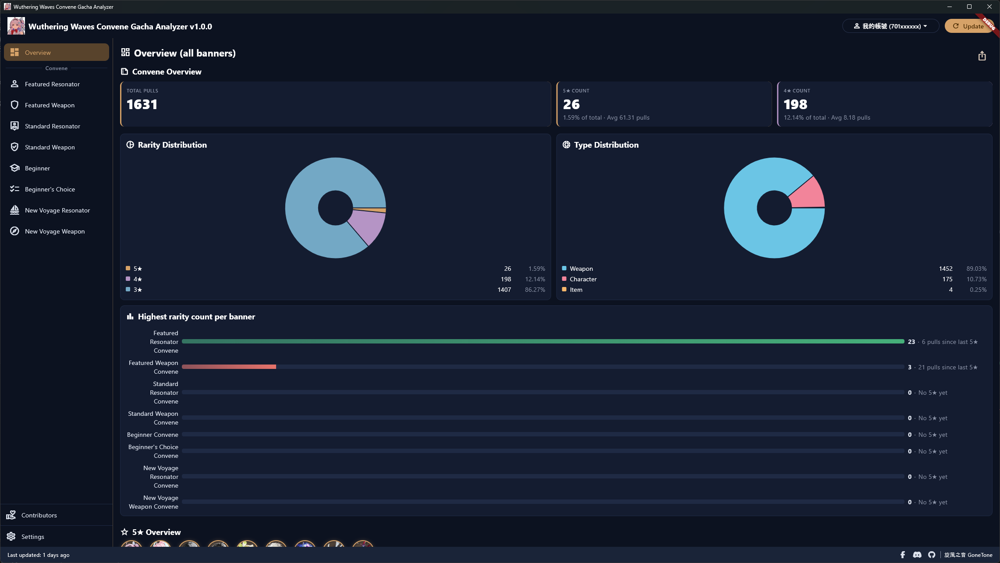
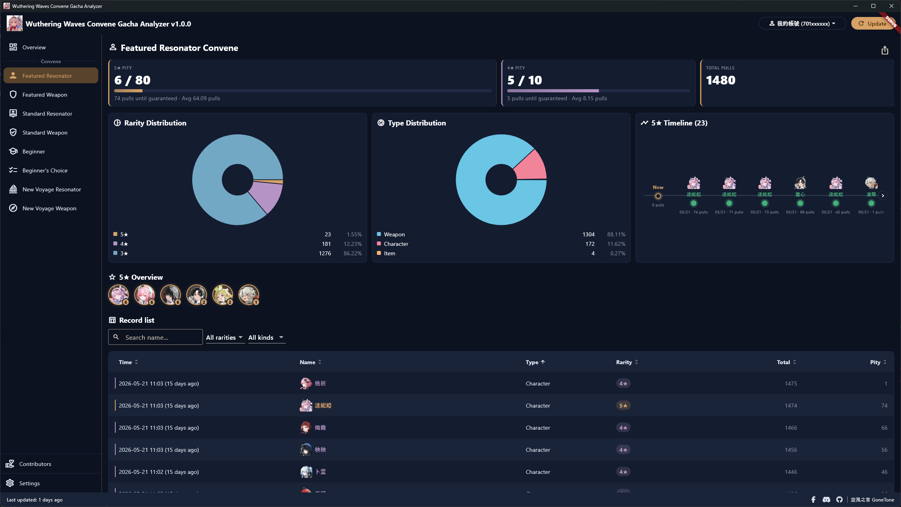
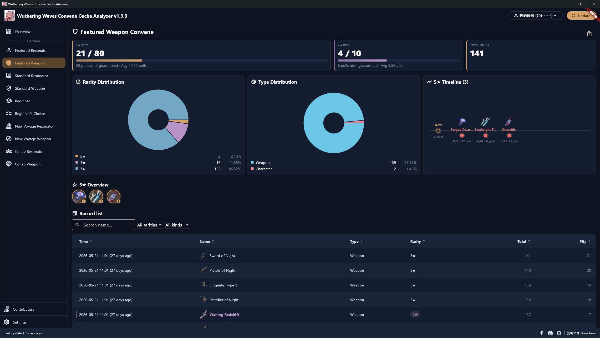
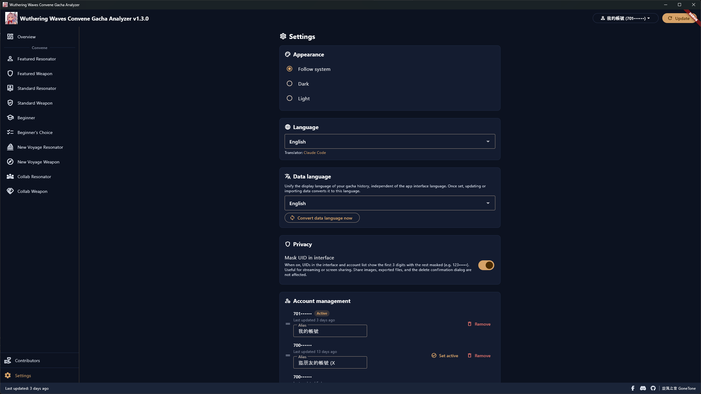
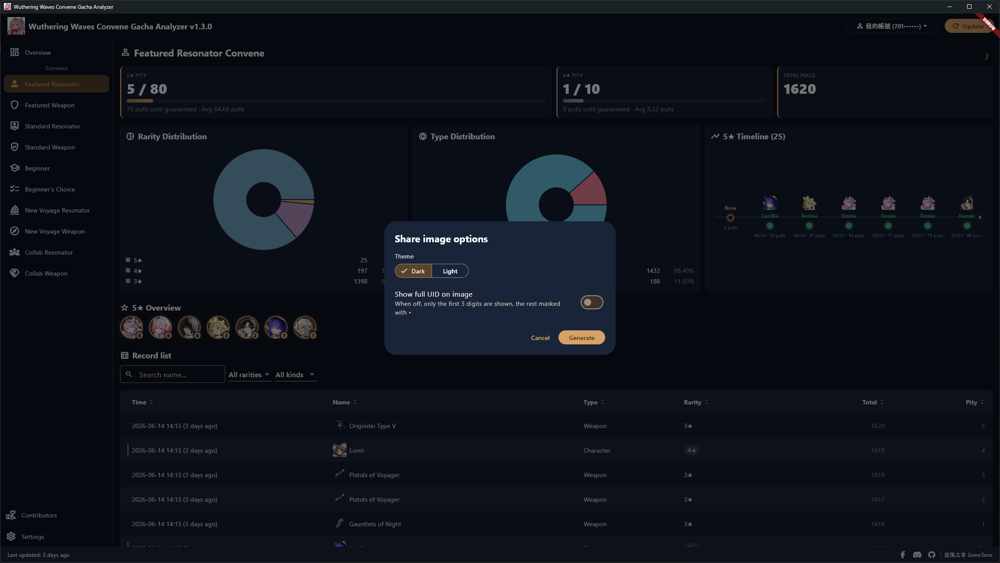
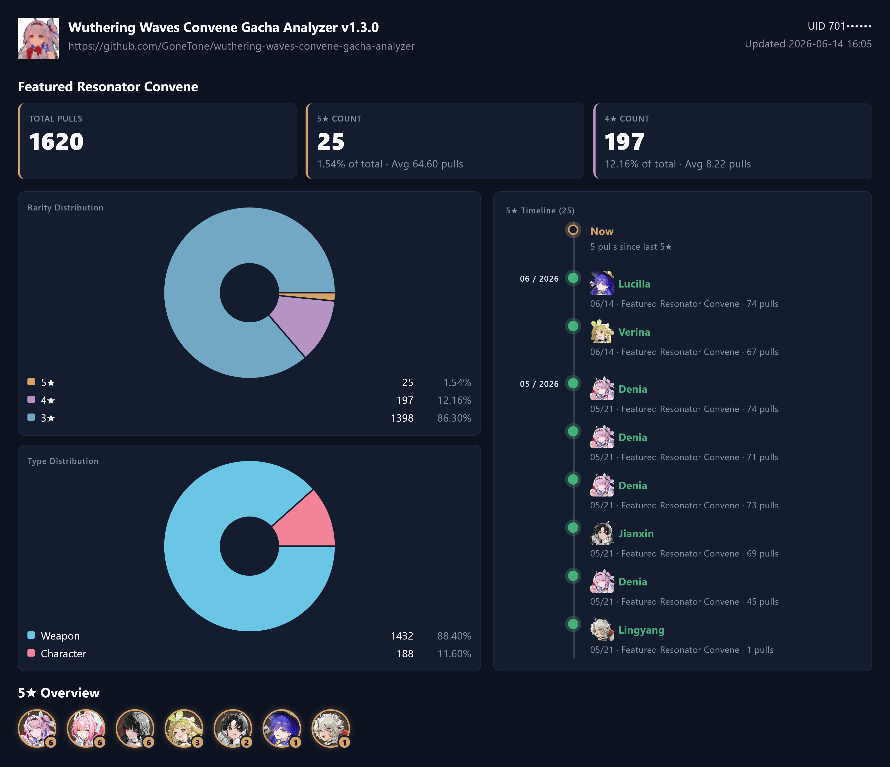
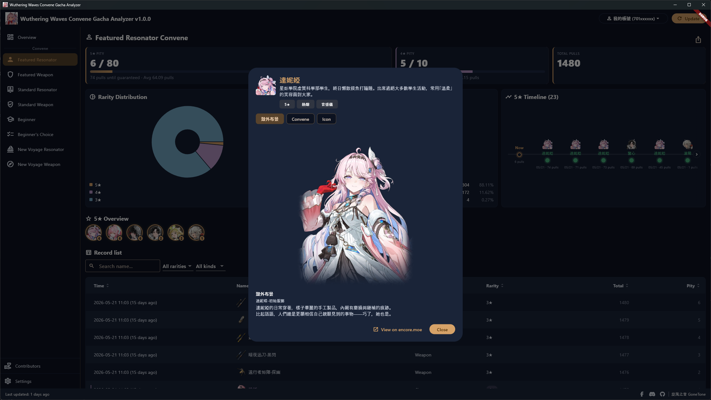

# 鳴潮喚取卡池分析 Wuthering Waves Convene Gacha Analyzer

[繁體中文](README.md) | [简体中文](README_ZH-HANS.md) | English

[](https://crowdin.com/project/wuthering-waves-convene-gacha-analyzer)

I have developed a utility for analyzing convene history, where all data and numbers are well-organized in a convenient manner.

When you press *Update*, the utility starts a local interception helper (running only on your computer; it requires administrator privileges, so you'll see a one-time UAC prompt — click Yes) and automatically installs a locally generated root certificate. It then redirects Wuthering Waves' convene-record page request to the official convene history API to your local machine for parsing, so it can capture that one request. You therefore need to open the convene record page in the game *after* pressing *Update*, so the request can be captured. The captured request is parsed for the parameters needed to query your convene records, which are then used to call the official API. Interception only runs during the update and stops immediately once done, restoring your network state.

The first time you press *Update*, the utility loads your full convene history, which may take a while. The data is then stored locally so you don't have to wait again on the next launch. To pull new records, just press *Update*: the utility remembers the previously captured parameters and reuses them as long as they're still valid, so you don't have to repeat the capture every time. If the captured parameters have expired, the utility will ask you to open the convene record page in the game again to re-capture.

Rest assured: this utility does not read or modify any game file or game memory, and does not affect how the game runs. It only intercepts and parses that single request to the official convene history API to obtain the query parameters; all other traffic passes through untouched. So there is no risk of being banned for using it. If you have been banned, it was likely for a different reason. Please do not blame us, thanks.

Posts:
- 巴哈姆特 (Bahamut): <https://forum.gamer.com.tw/C.php?bsn=74934&snA=17364>

## Multiple Language

Please help us translate this software.

<https://crowdin.com/project/wuthering-waves-convene-gacha-analyzer>

## Download Software

The utility may trigger anti-virus software during installation and execution. This is because it generates and installs a local root certificate, and when you press *Update* it launches an interception helper with administrator privileges (bundling the [WinDivert](https://github.com/basil00/WinDivert) kernel driver) that redirects the convene-record page request to your local machine — behavior (installing a certificate, loading a kernel driver, redirecting traffic) that resembles malware and is especially prone to false positives. However, the utility only intercepts the official convene history API, the certificate stays on your computer, and the source code is open for inspection. If the utility doesn't function correctly, please try disabling any anti-virus software you have installed. We guarantee this utility is safe and virus-free.

<https://github.com/GoneTone/wuthering-waves-convene-gacha-analyzer/releases>

### Versions for Other Games

- Genshin Impact: <https://github.com/GoneTone/genshin-impact-wish-gacha-analyzer>
- More games may be supported in the future...

## How to Use

1. Launch Wuthering Waves (don't open the convene record page yet).
2. Open this utility and press *Update*. The utility will start a local interception helper (a one-time UAC administrator prompt will appear — click Yes) and wait for the request.
3. Switch back to the game and open *Convene → Convene History* to view the convene record page.
4. Once captured, the utility automatically stops the interception, restores your network state, and starts fetching your data. To update again later, just repeat step 2 — the captured URL will be reused if still valid.

## Features

- Auto-intercepts the convene-record page request to the official convene history API via a local interception helper and a self-signed root certificate — no need to paste URLs by hand
- Supports the Global server (CN server not supported yet)
- Covers all 10 convene types: Featured Resonator Convene, Featured Weapon Convene, Standard Resonator Convene, Standard Weapon Convene, Beginner Convene, Beginner's Choice Convene, New Voyage Resonator Convene, New Voyage Weapon Convene, Collab Resonator Convene, Collab Weapon Convene
- Multi-account (UID) management: custom aliases, drag-to-reorder, one-click switching
- Incremental updates merge new records without overwriting old ones, so entries that fall off the official history won't disappear
- Total pulls and 5★ / 4★ / 3★ counts with their share of the total
- Dual pity progress (5★ and 4★) showing remaining pulls until pity
- Average pulls per 5★ / 4★ hit (per-banner and overall)
- Per-banner 5★ timeline
- 5★ overview: every distinct 5★ you've pulled laid out in a row, each with a cumulative count badge and clickable for details — shown on each banner page, the overview page, and the share image
- Bar chart comparing each banner's highest-rarity counts
- Rarity distribution pie chart
- Item type distribution pie chart
- Convene history table: multi-column sort, keyword search (by name), rarity and item-type filters, pagination
- Auto-fetched item icons (from the encore.moe API): characters, weapons, and items all have icons, shown in the table, timelines, and the 5★ overview
- Click any item for details: characters show the introduction, element, weapon type, and switchable Outfit and Convene artwork (the Convene art is captured live from encore's rendered canvas on your machine and cached — no artwork is redistributed); weapons show their description and weapon type
- Generate a share image in one click (dark / light theme, full UID or first-3-digits mask), automatically copied to the clipboard and optionally saved as a PNG file
- Export / Import accounts as JSON
- Dark / Light theme toggle
- Multi-language ([help us translate](https://crowdin.com/project/wuthering-waves-convene-gacha-analyzer))
- Optional UID masking in the UI (first 3 digits only) for added privacy
- Automatic update check on launch, with a manual trigger in Settings
- All data stays on your machine — nothing is uploaded

## Supported Third-Party Import Platforms

Besides importing this utility's own backup files, you can also import convene history data exported from the following third-party platforms (Settings → *Import data (other platforms)*):

- [WuWa Tracker](https://wuwatracker.com/)
- More platforms may be supported in the future...

## Screenshot









## Development

### Prerequisites

- Windows only for now
- [Flutter SDK](https://docs.flutter.dev/install) (latest stable)
- [Rust toolchain](https://rustup.rs/) (stable)
- Run `flutter doctor` and install anything it flags as missing

### Clone and install dependencies

```bash
git clone https://github.com/GoneTone/wuthering-waves-convene-gacha-analyzer.git
cd wuthering-waves-convene-gacha-analyzer
flutter pub get
```

Rust is compiled automatically by `rust_builder/`'s cargokit during `flutter run` / `flutter build`; no manual `cargo build` is needed (the Rust toolchain must be installed first).

### Run in development mode

```bash
flutter run -d windows
```

### Rust ↔ Dart bridge code generation

After changing Rust functions in `rust/src/api/`, regenerate the bridge code. Install the codegen tool on first use:

```bash
cargo install flutter_rust_bridge_codegen --version 2.12.0
```

Then run this whenever the API changes:

```bash
flutter_rust_bridge_codegen generate
```

Generated files live in `lib/src/rust/`.

### Build for release

```bash
flutter build windows --release
```

Output: `build\windows\x64\runner\Release\`

### Run tests

```bash
flutter test
cargo test --manifest-path rust/Cargo.toml
```
