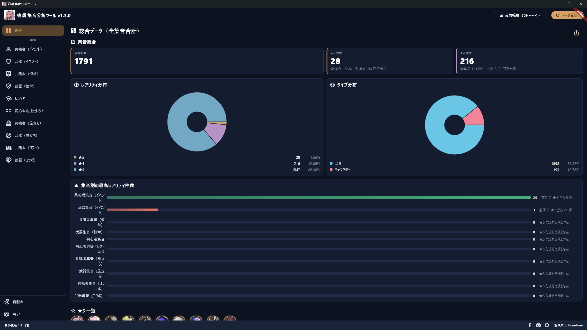
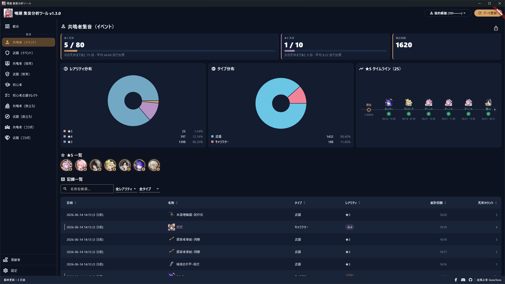
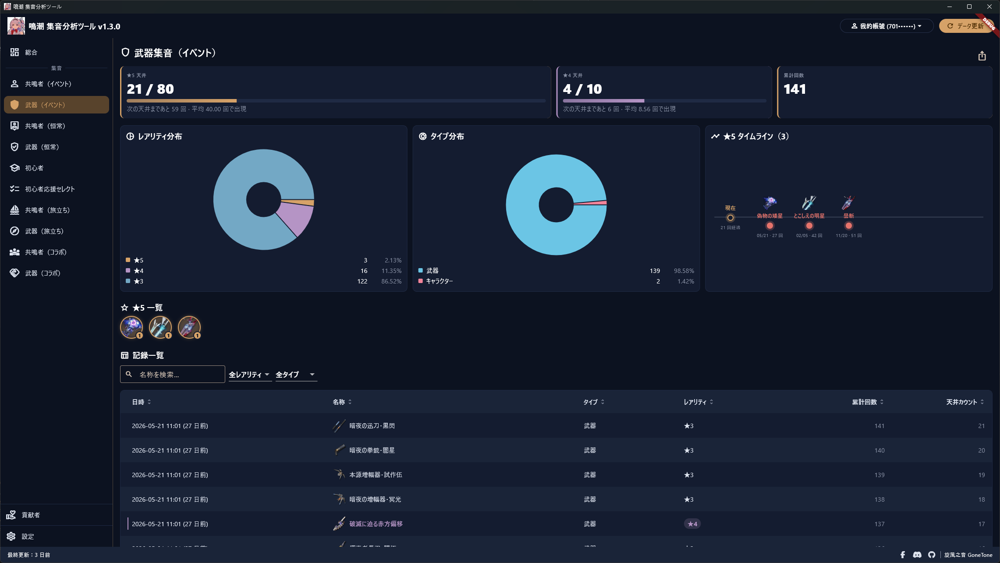
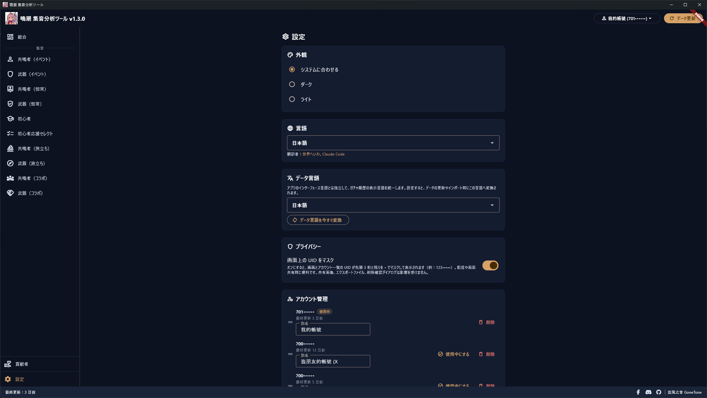
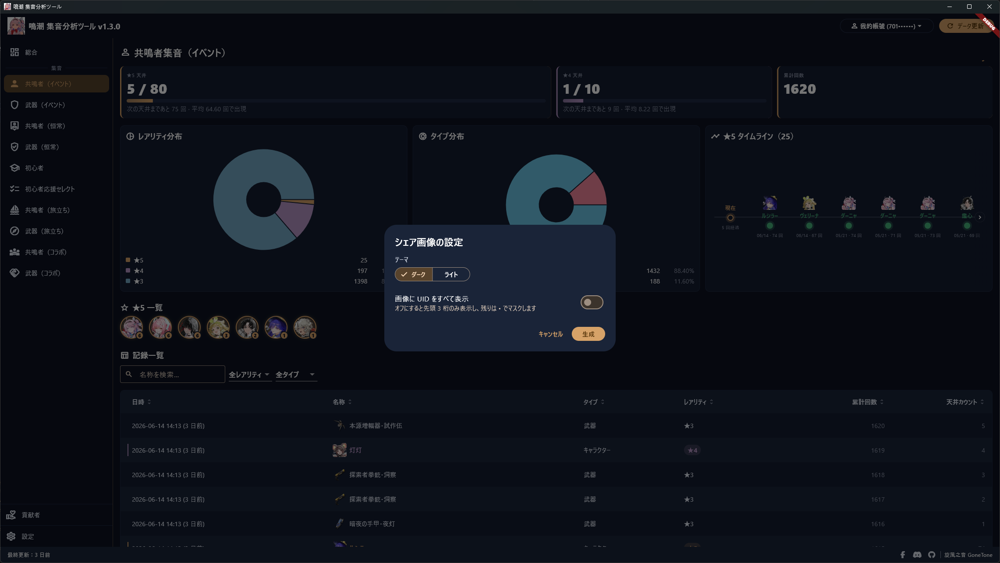
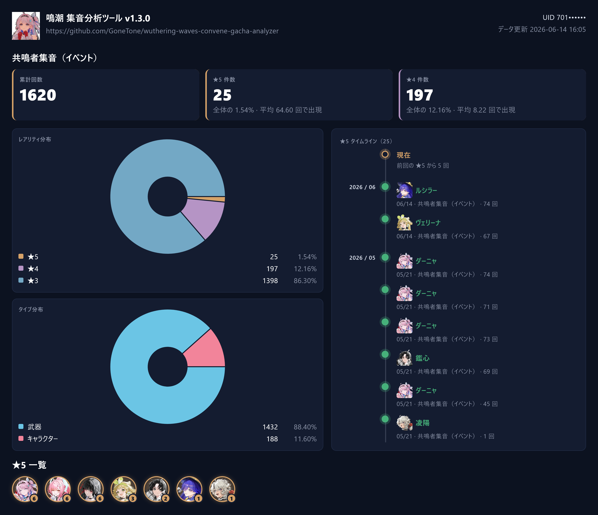
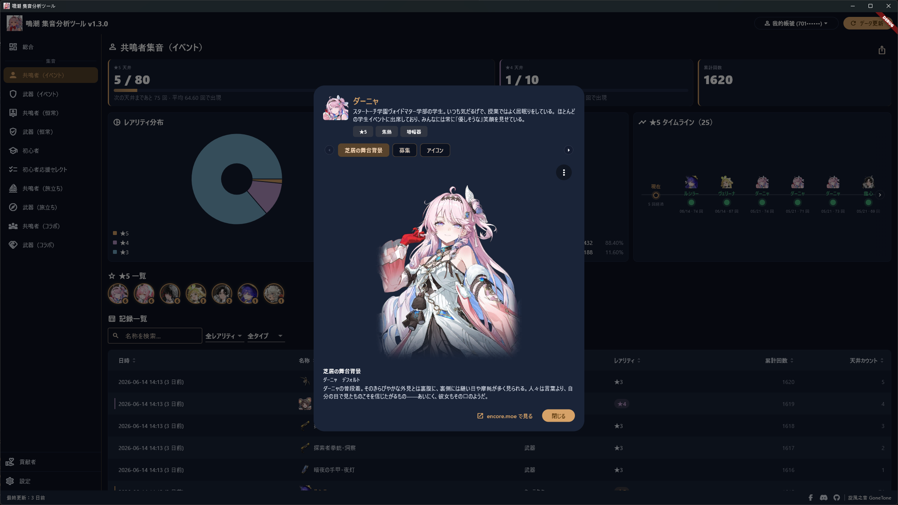

# 鳴潮集音分析ツール Wuthering Waves Convene Gacha Analyzer

[繁體中文](README.md) | [简体中文](README_ZH-HANS.md) | [English](README_EN.md) | 日本語

[](https://crowdin.com/project/wuthering-waves-convene-gacha-analyzer)

鳴潮の集音履歴を分析するためのソフトウェアを開発しました。起動するだけで各種データがひと目で分かり、もう手計算は不要です。

本ソフトウェアの仕組みは、「データ更新」を押すと、お使いのコンピューター上だけで動作するローカルの傍受プログラムを起動し（システム管理者権限が必要なため、UAC の確認が一度表示されます。「はい」を押してください）、ローカルで生成したルート証明書を自動でインストールします。続いて、鳴潮の集音履歴ページから公式の集音履歴 API へのリクエストをローカルへリダイレクトして解析することで、そのリクエストを傍受します。そのため、更新を押した後にゲーム内で集音履歴を開いて初めて傍受できます。傍受できたら、集音履歴の照会に必要なパラメーターを解析します。これらのパラメーターは公式の集音関連 API に使用されます。傍受は更新中のみ行われ、完了すると直ちに停止してネットワークの状態を元に戻します。

初めて「データ更新」を押すと、あなたの完全な集音履歴を読み込みます。これには少し時間がかかる場合があります。完了するとデータはお使いのコンピューター内に保存されるため、次回ソフトウェアを起動する際にデータの読み込みを待つ必要がなくなります。その後、新しいデータを取得したいときは「データ更新」を押すだけです。ソフトウェアは以前に傍受した照会パラメーターを記憶しており、使えるならそのまま再利用し、毎回傍受し直す必要はありません。照会パラメーターが失効している場合は、ゲームで集音履歴ページをもう一度開いて再傍受するようお願いします。

ご安心ください。本ソフトウェアはいかなるゲームファイルやメモリーも読み取ったり改ざんしたりせず、ゲーム自体の動作にも影響を与えません。集音履歴ページを開いたときに、公式の集音履歴 API への、そのひとつのリクエストだけを傍受して照会パラメーターを取得するだけで、その他すべての通信はそのまま素通しし、一切触れません。そのため、アカウントが BAN される心配はありません。もし BAN された場合は、別の原因ではないかをご検討ください。私たちのせいにしないでください。

記事：
- 巴哈姆特（Bahamut）：<https://forum.gamer.com.tw/C.php?bsn=74934&snA=17364>

## 多言語対応

本ソフトウェアを各国語へ翻訳するご協力をお願いします。

<https://crowdin.com/project/wuthering-waves-convene-gacha-analyzer>

## ソフトウェアのダウンロード

本ソフトウェアはインストールや実行時にウイルス対策ソフトによってブロックされることがあります。これは、本ソフトウェアがローカルのルート証明書を自ら生成してインストールし、更新を押した際にシステム管理者権限で傍受プログラム（[WinDivert](https://github.com/basil00/WinDivert) カーネルドライバーを内蔵）を起動して、鳴潮の集音履歴ページのリクエストをローカルへリダイレクトして解析するためです。こうした挙動（証明書のインストール、カーネルドライバーの読み込み、通信のリダイレクト）はマルウェアと似ているため、特に誤検知されやすくなっています。しかし本ソフトウェアは公式の集音履歴 API のみを傍受し、証明書はお使いのコンピューターに留まり、オープンソースなのでソースコードをご自身で確認できます。正常に実行できない場合は、ウイルス対策ソフトを無効にしてから実行してみてください。本ソフトウェアは無害であることを保証します。

<https://github.com/GoneTone/wuthering-waves-convene-gacha-analyzer/releases>

### 他のゲームに対応したバージョンもあります

- 原神：<https://github.com/GoneTone/genshin-impact-wish-gacha-analyzer>
- 今後さらに多くのゲームに対応するかもしれません...

## 使い方

1. 鳴潮を起動します（まだ集音履歴ページは開かないでください）。
2. 本ソフトウェアを開いて「データ更新」を押します。ソフトウェアがローカルの傍受プログラムを起動し（UAC のシステム管理者確認が一度表示されます。「はい」を押してください）、傍受を待機します。
3. ゲームに戻り、「集音 → 集音履歴」から集音履歴ページを開きます。
4. ソフトウェアが URL を傍受すると自動で傍受を停止し、ネットワークの状態を元に戻してデータの取得を開始します。その後再び更新したいときは手順 2 を繰り返すだけで、URL が失効していなければそのまま適用されます。

## 機能と特長

- 鳴潮の集音履歴ページから公式の集音履歴 API へのリクエストを自動傍受（ローカルの傍受プログラムと自己署名ルート証明書を利用）。URL を手動で貼り付ける必要はありません
- グローバルサーバーに対応（中国サーバーには現在未対応）
- 10 種類の集音を網羅：共鳴者集音（イベント）、武器集音（イベント）、共鳴者集音（恒常）、武器集音（恒常）、初心者集音、初心者応援セレクト集音、共鳴者集音（旅立ち）、武器集音（旅立ち）、共鳴者集音（コラボ）、武器集音（コラボ）
- 複数アカウント（UID）管理：エイリアスのカスタマイズ、ドラッグでの並べ替え、ワンクリック切り替え
- 新旧データを自動でマージし、過去の記録を上書きしません。公式の履歴が古くなって消えても、記録は失われません
- 総取得数および ★5 / ★4 / ★3 の件数と割合の統計
- ★5 と ★4 それぞれの天井プログレスバー。天井まで残り何回かを表示
- ★5 / ★4 の平均排出回数の統計（集音ごとおよび全体）
- 集音ごとの ★5 タイムライン
- ★5 総覧：これまでに引いたすべての重複しない ★5 を横並びで表示し、それぞれに累計回数のバッジを付け、クリックで詳細を表示。各集音ページ、総合データページ、シェア画像のいずれにも表示されます
- 集音ごとの最高レアリティ件数を比較する棒グラフ
- レアリティ分布の円グラフ
- タイプ分布の円グラフ
- 履歴テーブル：複数列ソート、キーワード検索（名前による）、レアリティとアイテムタイプでの絞り込み、ページネーション
- アイテムアイコンの自動取得（出典：encore.moe API）：共鳴者、武器、アイテムのいずれにもアイコンがあり、テーブル、タイムライン、★5 総覧に対応するアイコンを表示します
- アイテムをクリックして詳細を表示：共鳴者は概要、属性、武器タイプ、および切り替え可能な「衣装」と「募集」の立ち絵を表示（募集の立ち絵は encore がレンダリングした画面をローカルでリアルタイムに取り込んでキャッシュするもので、アートを再配布しません）。武器は概要と武器タイプを表示します
- ワンクリックでシェア画像を生成（ダーク / ライトテーマ、UID をすべて表示するか先頭 3 桁のみ残してマスクするかを選択可能）。自動でクリップボードにコピーし、PNG ファイルとして保存することもできます
- アカウントデータを JSON でエクスポート / インポート
- ダーク / ライトテーマの切り替え
- 多言語対応（[翻訳にご協力ください](https://crowdin.com/project/wuthering-waves-convene-gacha-analyzer)）
- 設定で画面上の UID マスク（先頭 3 桁のみ表示）を有効にでき、プライバシーを保護します
- 起動時に自動で新バージョンをチェック。設定ページから手動で実行することもできます
- すべてのデータはローカルに留まり、アップロードされません

## インポートに対応したサードパーティープラットフォーム

本ソフトウェア自身がエクスポートしたバックアップファイルのインポートに加えて、以下のサードパーティープラットフォームからエクスポートした集音履歴データもインポートできます（設定ページ →「他のプラットフォームからインポート」）：

- [WuWa Tracker](https://wuwatracker.com/)
- 今後さらに多くのプラットフォームに対応するかもしれません...

## スクリーンショット









## 開発

### 前提条件

- 現在は Windows のみ対応
- [Flutter SDK](https://docs.flutter.dev/install)（最新の安定版）
- [Rust toolchain](https://rustup.rs/)（stable）
- `flutter doctor` を実行し、不足しているツールを指示に従って補ってください

### ソースコードの取得と依存関係のインストール

```bash
git clone https://github.com/GoneTone/wuthering-waves-convene-gacha-analyzer.git
cd wuthering-waves-convene-gacha-analyzer
flutter pub get
```

Rust は `flutter run` / `flutter build` の際に `rust_builder/` の cargokit によって自動でコンパイルされるため、手動で `cargo build` する必要はありません（ただし事前に Rust toolchain のインストールが必要です）。

### 開発モードでの実行

```bash
flutter run -d windows
```

### Rust ↔ Dart ブリッジコードの生成

`rust/src/api/` 内の Rust 関数を変更した後、ブリッジコードを再生成します。初回利用前に codegen ツールをインストールしてください：

```bash
cargo install flutter_rust_bridge_codegen --version 2.12.0
```

以降は API を変更するたびに実行します：

```bash
flutter_rust_bridge_codegen generate
```

生成されたファイルは `lib/src/rust/` に配置されます。

### 本番版のビルド

```bash
flutter build windows --release
```

出力：`build\windows\x64\runner\Release\`

### テストの実行

```bash
flutter test
cargo test --manifest-path rust/Cargo.toml
```
