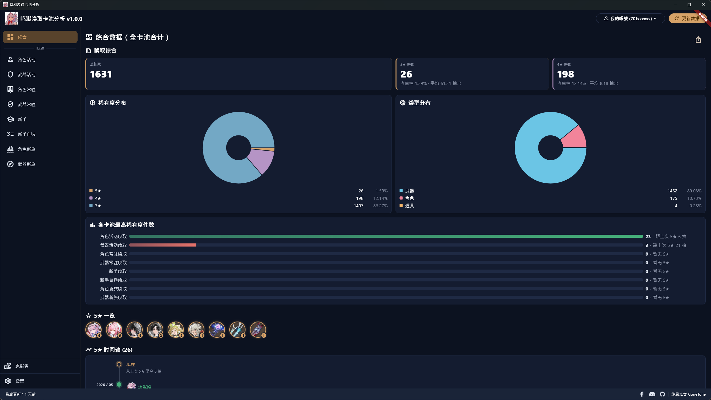
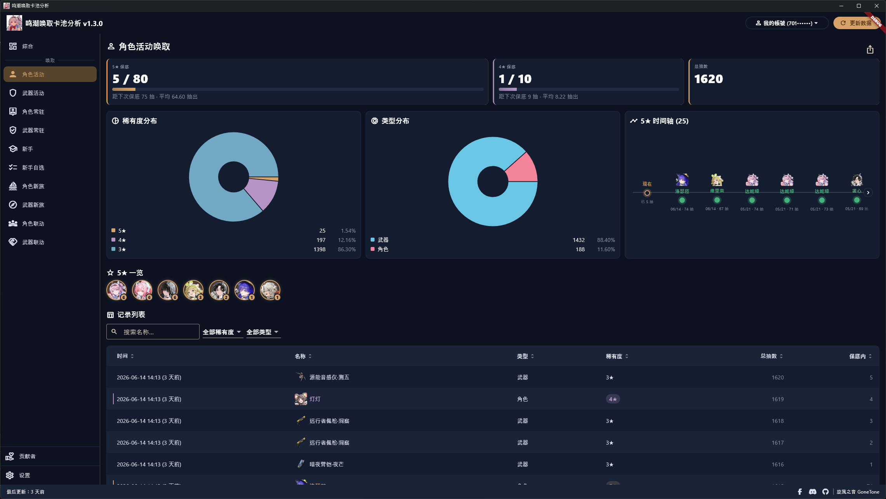
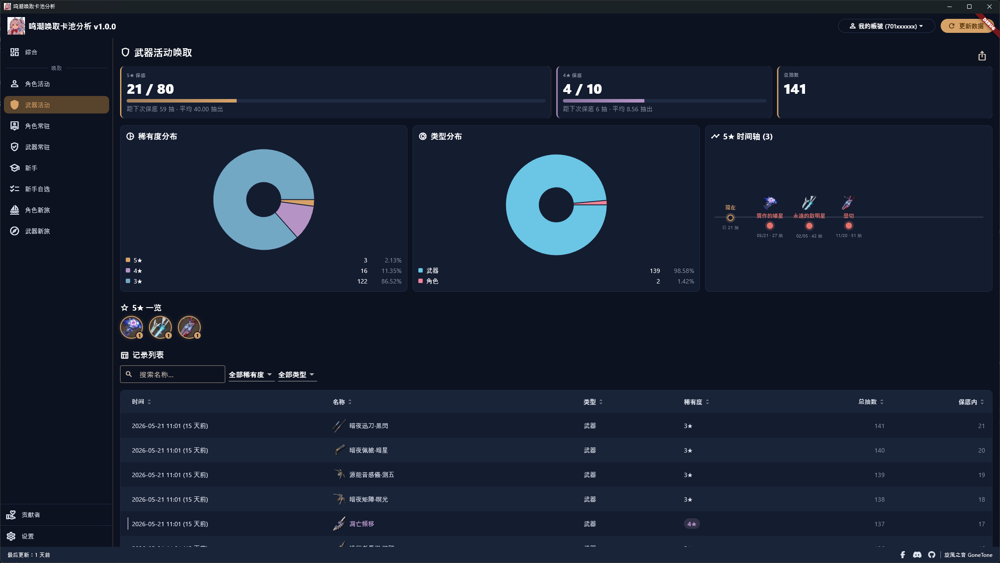
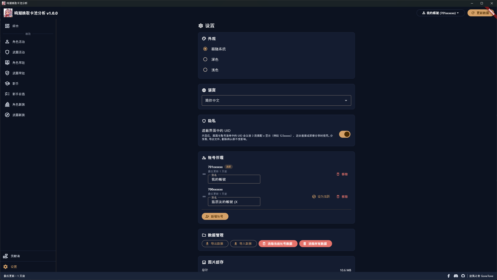
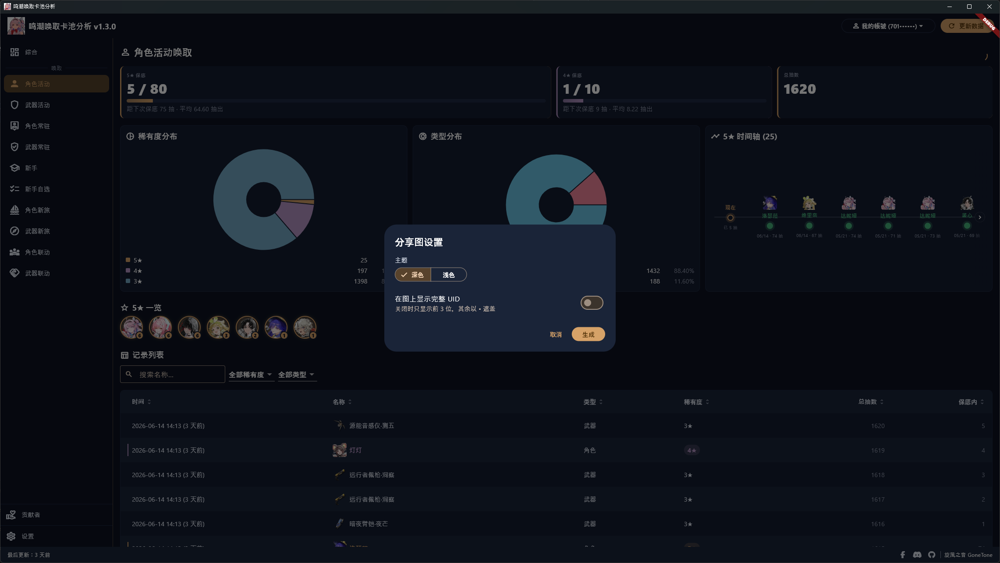
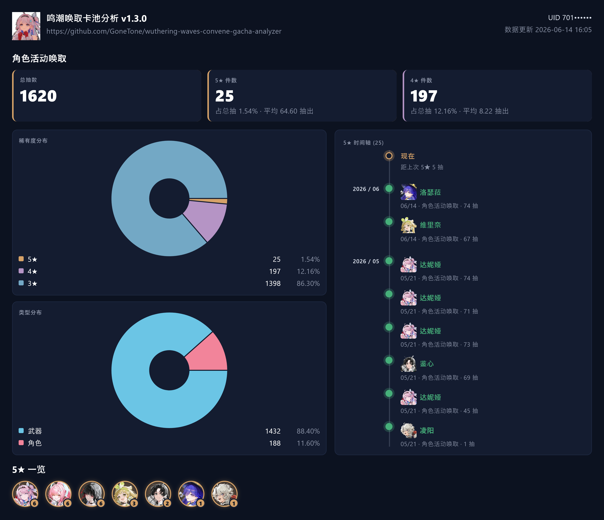
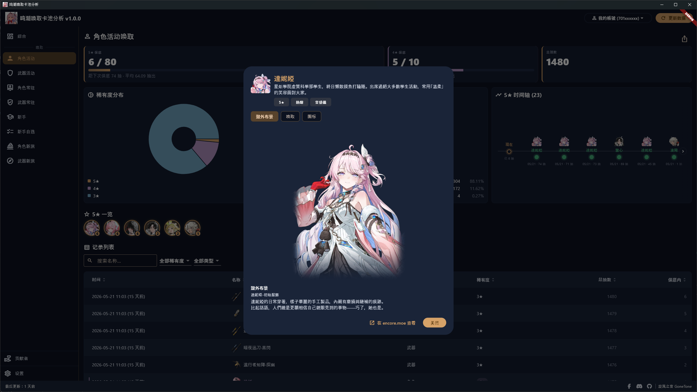

# 鸣潮唤取卡池分析 Wuthering Waves Convene Gacha Analyzer

[繁體中文](README.md) | 简体中文 | [English](README_EN.md)

[](https://crowdin.com/project/wuthering-waves-convene-gacha-analyzer)

我开发了一套用来分析唤取卡池历史记录的软件，一打开各种数据清清楚楚，不用再手动计算啦！

本软件的原理是：按下「更新数据」后，会在本机启动一个只跑在您电脑上的拦截程序（需要管理员权限，因此会弹出一次 UAC 确认，请按「是」），并自动安装一张本机生成的根证书；接着把鸣潮唤取记录页面对官方唤取历史 API 的那一条请求重定向到本机解析，借此拦下该请求。所以要在按下更新后再到游戏内打开唤取记录才能拦到，拦到后解析出查询唤取记录所需的参数，这些参数会用于官方唤取相关的 API。拦截只在更新期间进行，完成后立即停止并还原网络状态。

第一次按下「更新数据」会加载您完整的唤取历史，这可能需要一些时间，完成后会将数据保存在您的电脑上，这样下次打开软件就不用再花时间等待数据加载。之后想获取新数据按一下「更新数据」即可，软件会记住先前拦到的查询参数，能用就直接用、不用每次重新拦截；如果查询参数过期，软件会请您再到游戏打开一次唤取记录页面以重新拦取。

请放心：本软件不会读取或篡改任何游戏文件与内存，也不影响游戏本身的运行；只会在唤取记录页面打开时，拦下并解析那一条对官方唤取历史 API 的请求以获取查询参数，其余所有流量原样放行、完全不碰。所以不会有账号被封禁的风险。如果您被封号，请思考是否因为其他原因被封禁，不要怪我们。

帖子：
- 巴哈姆特：<https://forum.gamer.com.tw/C.php?bsn=74934&snA=17364>

## 多国语言

请帮我们将软件翻译成各国语言！

<https://crowdin.com/project/wuthering-waves-convene-gacha-analyzer>

## 下载软件

软件在安装或运行时有可能会被杀毒软件拦截。原因是本软件会自行生成并安装一张本机根证书，并在按下更新时以管理员权限启动一个拦截程序（内含 [WinDivert](https://github.com/basil00/WinDivert) 内核驱动）把鸣潮唤取记录页面的请求重定向到本机解析——这类行为（安装证书、加载内核驱动、重定向流量）与恶意程序相似，特别容易被杀毒误判。但本软件只拦截官方唤取历史 API、证书只留在您的电脑上、且为开源可自行查看源代码。如果无法正常运行，请尝试关闭杀毒软件后再运行试试，本软件保证无毒。

<https://github.com/GoneTone/wuthering-waves-convene-gacha-analyzer/releases>

### 也有支持其他游戏的版本

- 原神：<https://github.com/GoneTone/genshin-impact-wish-gacha-analyzer>
- 未来可能新增支持更多游戏...

## 使用方法

1. 启动鸣潮，先别打开唤取记录页面。
2. 打开本软件并按下「更新数据」，软件会启动本机拦截程序（会弹出一次 UAC 管理员确认，请按「是」）并等候拦截。
3. 切回游戏，到「唤取 → 唤取记录」打开唤取记录页面。
4. 软件拦到网址后会自动停止拦截、还原网络状态并开始抓取数据；之后想再更新只要重复步骤 2，网址未过期就会直接使用。

## 功能与特色

- 自动拦截鸣潮唤取记录页面对官方唤取历史 API 的请求（通过本机拦截程序与自签根证书），无需手动粘贴网址
- 支持国际服（暂不支持国服）
- 涵盖 10 种卡池：角色活动唤取、武器活动唤取、角色常驻唤取、武器常驻唤取、新手唤取、新手自选唤取、角色新旅唤取、武器新旅唤取、角色联动唤取、武器联动唤取
- 多账号 (UID) 管理：自定义别名、拖动排序、一键切换
- 自动合并新旧数据，不覆盖过往记录，不会因为官方历史记录过期而丢失
- 总抽数及 5★ / 4★ / 3★ 数量与占比统计
- 5★ 与 4★ 双保底进度条，并显示距离保底的剩余抽数
- 5★ / 4★ 平均出货抽数统计（各卡池与整体）
- 各卡池 5★ 时间轴
- 5★ 总览：横向陈列抽到过的所有不重复 5★，每个附累计次数徽章、可点开详情；各卡池页、综合数据页与分享图都会显示
- 各卡池最高稀有度数量对比柱状图
- 稀有度分布饼图
- 类型分布饼图
- 历史记录表格：多列排序、关键字搜索（按名称）、稀有度与物品类型筛选、分页
- 自动补上物品图标（来源：encore.moe API）：角色、武器、道具均有图标，表格、时间轴与 5★ 一览都会显示对应图标
- 点击物品打开详情：角色显示简介、元素、武器类型，以及可切换的「造型」与「唤取」立绘（唤取立绘在本机即时抓取 encore 已渲染画面并缓存，不重新散布美术）；武器显示简介与武器类型
- 一键生成分享图（可选深色 / 浅色主题、UID 全显或只留前三码遮罩），自动复制到剪贴板，并可另存为 PNG 文件
- 账号数据导出 / 导入 JSON
- 深色 / 浅色主题切换
- 多国语言（[协助翻译](https://crowdin.com/project/wuthering-waves-convene-gacha-analyzer)）
- 可在设置开启界面 UID 遮罩（只显示前三码），保护隐私
- 启动时自动检查新版本，也可在设置页手动触发
- 所有数据留在本机，不上传

## 支持导入的第三方平台

除了导入本软件自己导出的备份文件，您也可导入从以下第三方平台导出的唤取历史数据（设置页 →「导入数据（其他平台）」）：

- [WuWa Tracker](https://wuwatracker.com/)
- 未来可能新增支持更多平台...

## 截图









## 开发

### 前置需求

- 目前仅支持 Windows
- [Flutter SDK](https://docs.flutter.dev/install)（最新稳定版）
- [Rust toolchain](https://rustup.rs/)（stable）
- 运行 `flutter doctor`，根据提示补齐缺少的工具

### 获取源代码并安装依赖

```bash
git clone https://github.com/GoneTone/wuthering-waves-convene-gacha-analyzer.git
cd wuthering-waves-convene-gacha-analyzer
flutter pub get
```

Rust 会在 `flutter run` / `flutter build` 时由 `rust_builder/` 的 cargokit 自动编译，无需手动 `cargo build`（但需先安装 Rust toolchain）。

### 开发模式运行

```bash
flutter run -d windows
```

### Rust ↔ Dart 桥接代码生成

修改 `rust/src/api/` 内的 Rust 函数后，重新生成桥接代码。第一次使用前先安装 codegen 工具：

```bash
cargo install flutter_rust_bridge_codegen --version 2.12.0
```

之后每次修改 API 都运行：

```bash
flutter_rust_bridge_codegen generate
```

生成的文件位于 `lib/src/rust/`。

### 编译生产版

```bash
flutter build windows --release
```

输出：`build\windows\x64\runner\Release\`

### 运行测试

```bash
flutter test
cargo test --manifest-path rust/Cargo.toml
```
